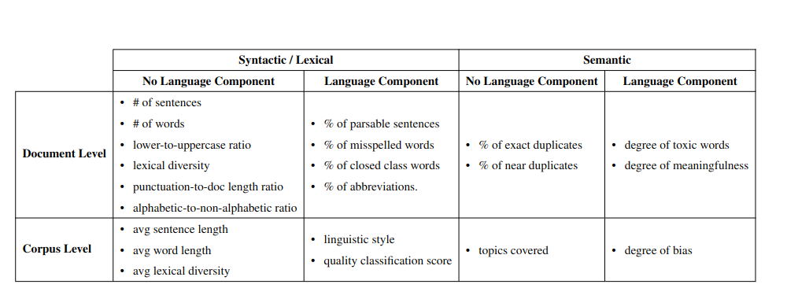
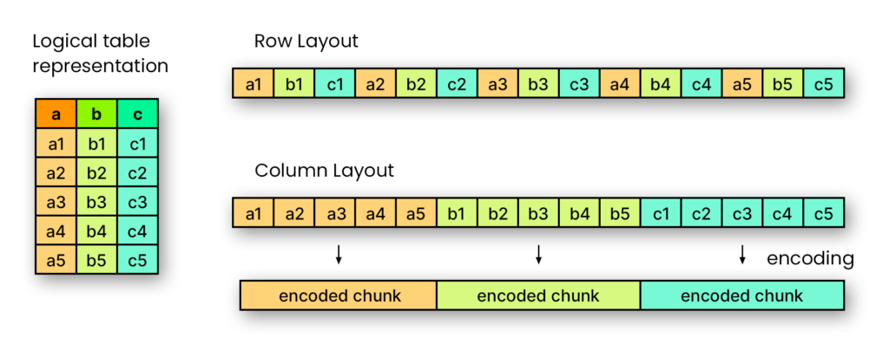
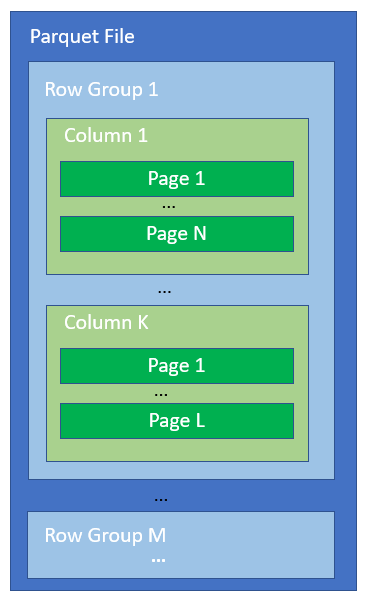
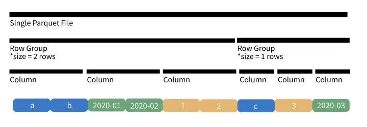
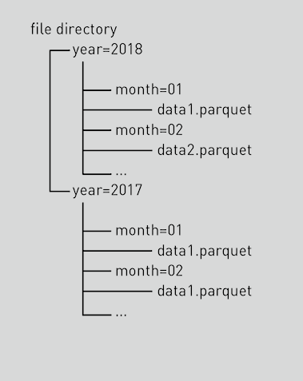

# Metadata Management

We aleady use a lot of datasets. More and more users work with data and got a good impression about our data. Now it is time to define a metadata concept. That is why we want to collect best practices, technolgies and tools keeping our project needs in mind.
This document is about metadata management for the datasets (not for trainings, models, ...).

## TODOs

1. Technical decision how to store metadata (python + YAML)
2. Decision where to store metadata (folders tructure)
3. Content of metadata
4. Row-based metadata
5. Metadata from experiments and models

## In short

- We want to use YAML for metadata
- We want to read and write metadata mainly with Python
- We want to store metadata next to the data (`metadata.yaml` next to the `data/` folder)

## General metadata content

Overlap is possible!

- general metadata to understand what's in the dataset
- intermediate corpus-level metadata from calculation (to avoid long repeating pipeline steps)
- quality metrics
- versioning / tracibility - when, who and what was done on the dataset

## Specific metadata content

AP2 already prepared a lot metadata content and grouped it in a table:



This is a perfect foundation and can be adjusted and enhanced later on.

## Example structure

```
s3://opengptx/datasources_ogptx/docs/v0.1.2/
    en/
        bundestag/
            metadata.yaml
            (metadata_biases.yaml)
            data/
```

## Example metadata 

```
{
  "train": {
    "word_count": {
      "de": {
        "bundestag": 880067683,
        "oscar": 40113103765,
        "paracrawl": 3198486559,
        "newspaper_iais": 2948433594,
        "wiki40b": 522202653,
        "opensubtitles": 181117003,
        "dta": 23213074,
        "one_million_posts": 4028219
      }
    },
    "en": {
      "pile": 50171390868
    }
  },
  "validation": {
    "word_count": {
      "de": {
        "bundestag": 224480959,
        "oscar": 10033553087,
        "paracrawl": 799902282,
        "newspaper_iais": 737217171,
        "wiki40b": 130612178,
        "opensubtitles": 45311523,
        "dta": 4511067,
        "one_million_posts": 994710
      }
    },
    "en": {
      "pile": 33475743843
    }
  }
}
```

## Example code

Install dependencies:
```
pip install pyyaml
```

Write YAML (pick either JSON style or YAML as you prefer):
```
import yaml

### JSON style start
metadata = {"train":{"word_count":{"de":{"bundestag":880067683}}},
        "weekday":["monday","tuesday","wednesday","thursday","friday","saturday","sunday"],
        "months":["jan","feb","mar","apr","may","june","july"]}
### JSON style end

### YAML style start
metadatayaml = """
train:
  word_count:
    de:
      bundestag: 880067683
weekday:
  - monday
  - tuesday
  - wednesday
  - thursday
  - friday
  - saturday
  - sunday
months:
  - jan
  - feb
  - mar
  - apr
  - may
  - june
  - july
"""

metadata = yaml.safe_load(metadata_yaml)
### YAML style end

with open(r'metadata.yaml', 'w') as file:
    yaml.dump(metadata, file)
```

Read YAML:
```
with open(r'metadata.yaml', 'r') as file:
    metadata = yaml.safe_load(file)

print(metadata['train']['word_count']['de']['bundestag'])
```


## Metadata tools

In the Spark context, the Hive metadatastore is very often used to persist metadata. It is a central place in the organisation to get an overview about datasets in different places.

In our context we are partly on AWS, IONOS and multiple HPCs which have different tech stacks. It is hard to unify them. The question is, whether a central tool produces a benefit over the additional work. 

Metadata tools would need maintenance, usermanagement and would introduce dependencies on the platform and complexity for the users without having a real benefit in our context. That is the reason why we do not consider a central tool for metadata at the moment (at this point it is worth to repeat that the topic does not belong to metadata for trainings, models, ...).

As a summmary: a lightweight and platform independed approach is the key.

## File format

In this section you can find a brief overview about the following file formats: XML, CSV, JSON, Parquet and Avro.

|                         | CSV                    | JSON                   | Parquet | Avro |
| ----------------------- | ---------------------- | ---------------------- | ------- | ---- |
| Columnar                | No                     | No                     | Yes     | No   |
| Compressible            | Yes, when uncompressed | Yes, when uncompressed | Yes     | Yes  |
| Splittable              | Yes                    | Yes                    | Yes     | Yes  |
| Human Readable          | Yes                    | Yes                    | No      | No   |
| Nestable                | No                     | Yes                    | Yes     | Yes  |
| Complex Data Structures | No                     | Yes                    | Yes     | Yes  |
| Schema evolution        | No                     | No                     | Yes     | Yes  |

The main disadvantage of JSON is the bad performance in comparison to the other file formats but this is not really critical when storing metadata because the size is relatively small. Whereas the strenghts of JSON are the clearly defined schemes, the ability to store complex data and being human readable.

JSON and XML belong relatively close together in this comparison but XML is older, the files are larger and not that common nowadays anymore.

### JSON vs. YAML

Technically YAML is a superset of JSON. Which means (in theory at least), a YAML parser can understand JSON, but not necessarily the other way around. A `+` means a pro for YAML, A `-` means a pro for JSON found at [stackoverflow](https://stackoverflow.com/questions/1726802/what-is-the-difference-between-yaml-and-json):

`+` YAML is visually easier to look at / easy for a human to read

`+` Python programmers are generally big fans of YAML, because of the use of indentation, rather than bracketed syntax, to indicate levels. 

`+` YAML is more robust about embedding other serialization formats such as JSON or XML within a YAML file.

`-` JSON is often faster and is probably still interoperable with more systems

`-` JSON is much faster to serialize and deserialize because of significantly less features than YAML to check for, which enables smaller and lighter code to process JSON.

`-` YAML actually requires more characters than JSON

`+` YAML has the ability to reference other items within a YAML file using "anchors".

`+` Duplicate keys, which are potentially valid JSON, are definitely invalid in YAML.

`+` The lack of comments in JSON is, in practice, a real pain.

`-` YAML has widespread support, but is less ubiquitous than JSON, and each parser implements a different subset. Hence YAML files are less interoperable than you might think.

All in all:
- Python programmers tend towards preferring YAML, JavaScript programmers towards JSON.
- JSON is the winner for performance (if relevant) and interoperability. YAML is better for human-maintained files.
- A good test about performance can be found in this [comment](https://stackoverflow.com/a/62843005). 
- There are a plethora of parsers that work very well in all languages for both YAML and JSON.
- It is relatively easy to convert one of those formats into the other. Be forewarned though, you will lose comments when converting a YAML document to JSON.
- Most of the time people will not use those extra features and the main difference is that YAML uses indentation whilst JSON uses brackets.

Since we are more in a Python context, the performance is not relevent for small metadata files and the human readibility is a key factor in metadata, YAML is prefered. By avoiding the usage of advanced features (like comments, anchors, ...) in YAML, we ensure very good compatibility with parsing libraries and being able to easily convert into JSON if needed.

Hence the file format YAML without using advanced YAML features (to be compatible with JSON) is the best option in our context to store metadata.

## Programming language

Since we heavily rely on Spark as a distributed compute engine to process the datasets, at a first glance it looks like it should be also used for metadata management. But it has a lot disadvanatges by design. Writing JSON with spark by using `dataframe.write.json("metadata.json")` actually writes JSONL and not JSON which makes it harder to read the file with other languages. There are ways (like [here](https://stackoverflow.com/questions/58238563/write-spark-dataframe-as-array-of-json-pyspark) and [here](https://stackoverflow.com/questions/48503419/spark-dataframe-serialized-as-invalid-json)) to workaround this but it is quite complex and not that easy to understand.

However, we are already close to Python due to using PySpark to execute Spark. Python can easily process JSON and can easily upload files onto S3.

Hence pure Python is the best option in our context to read and write metadata from/to JSON files. Of course other programming languages are also capable doing so.

## Data Mesh

In this section are some important principles and thoughts about "Data Mesh". This topic is huge but it brings some of the important points related to our context of metadata.

### Principle

- Principle of Domain Ownership - Decentralize the ownership of analytical data to business domains closest to the data.
- Principle of Data as a Product: discoverable, addressable, understandable
- Principle of the Self-Serve Data Platform: Abstract data management complexity and reduce the cognitive load of domain teams in managing the end-to-end life cycle of their data products.
- Principle of Federated Computational Governance: The governance execution model heavily relies on codifying and automating the policies at a fine-grained level, for every data product, via the platform services.

### Enable Autonomous Teams to Get Value from Data

Metadata should be next to the data itself and should bringt a good overview about the content of the data.

### Introduce feedback loops

Based on new learnings and experience (feedback from data users and data owners), the metdadata management can be improved and extended. E.g. we can add more metdadata or we can improve the code to generate the metdata.


# Row-level metadata

Row-level metadata is not comparable to corpus-based metadata. No matter how big the dataset is, the amount of corpus-based metadata is relatively smiliar between the datasets. Whereas row-level metadata scales quite linear to the size of the dataset. The more rows you have, the more metadata you need to store. That is why we need to consider scalability and distribution. It is a big data topic.

## Storing row-based metadata in separated dataset? Join

Joins and shuffles are extremely resource heavy and often lead to out of memory exceptions when having big datasets. That is why we should avoid storing metadata in a separate dataset with a unique id as join condition.

Storing the metadata in the same dataset like the original data, sounds inefficient but after reading the next sections and understanding the technological features, the benefits will be clear.

## Parquet

The following picture shows the difference between columnar- and row-based layout. Due to columnar encoded chunks, parquet can read specific columns and can ignore (so it does not read) other columns. This makes clear, having lots of additional columns for metadata does not impact the reading part when not using them:



To go more into the details of the structure of parquet files, the following picture is a very good overview. A Parquet file consists of one or more Row Groups, a Row Group consists of one data chunk for every column following each other, and every data chunk consists one or more Pages with the column data. This means a single Row Group contains data for all columns for some number of rows, and if we look at the content of a Row Group, first we will see the data for the first column, then the data for the second column and so on. If you need to read a single column from a Parquet file, you have to read the corresponding column chunks from all Row Groups, but you do not need to read the full content of all Row Groups. All in all from a deeper perspective it is clear that the partial read is very efficient:



If it helps, here is another layout of parquet. It also indicates additional metadata on row-group-level which can make reading even more efficient when using special queries (but this is more magic in the background):



As the last point it is worth to mention that parquet can be partitioned on .parquet file level. In the following picture it is partioned on year+month and if you select a query e.g. on januar 2018, it is intelligent enough just to read the according .parquet file without reading the rest. Think about doing a partitioning e.g. on language level like en and de:




## Delta architecture

The delta architecture is based on having multiple buckets (can be also folders in one bucket) which are often called bronze, silver and gold where the data quality improves from one bucket to the other bucket.

- bronze: raw data (in the correct format that the tools can efficiently work with, e.g. parquet with snappy compression) - it is always good to have the raw data if somebody wants to start at this point from scratch
- silver: its filtered, cleaned, augmented data (multiple silver buckets in different qualities/steps are possible if needed)
- gold: business-level aggregations - can be directly consumed by apps or to train a model

## Implementation plan / steps

1. Delta architecture (bronze) rename datasources_ogptx/docs/ rename datasources_ogptx/raw/
2. Delta architecture (silver) datasources_ogptx/raw_with_metadata/ => combine (3) versions into 1 version. the solution can look like:
```
+-----------+--------------------+-------------------+----------------+---------------+---------------+-----------------------+---------------+-----------------+
|    uniq_id|                text|__null_dask_index__|mean_word_length|total_num_words|total_num_sents|non_alphabetwords_ratio|stop_word_count|lexical_diversity|
+-----------+--------------------+-------------------+----------------+---------------+---------------+-----------------------+---------------+-----------------+
|25769803776|Deutscher Bundest...|                  0|            6.24|         5235.0|          241.0|                   0.06|         1933.0|             0.34|
|25769803777|Deutscher Bundest...|                  1|            6.24|         5235.0|          241.0|                   0.06|         1933.0|             0.34|
...
```
3. Metadata creating pile failed? no spark native functions used?
4. Introduce partitioning