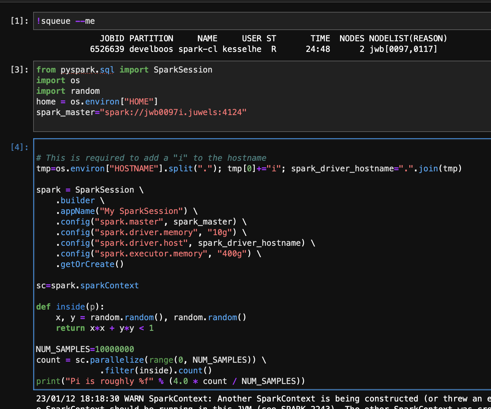

# Spark-Examples

## Interactive Spark Cluster
Script `start_spark_cluster.sh`. Spin up a Spark cluster with the specified number of nodes. 

### tldr;
To start your spark cluster on the cluster, simply run:
```bash
sbatch start_spark_cluster.sh
```
You only need to pick the number of nodes you need.

### Preparation
1. Clone this repo
```bash
git clone https://gitlab.jsc.fz-juelich.de/AI_Recipe_Book/recipes/spark-examples.git
```
2. Prepare the virtual environment to install required Python dependencies. 
- `cd spark_env`
- Edit `requirements.txt`
- Create the virtual environment by calling `./setup.sh`
- Create a kernel for Jupyter-JSC by calling `./create_kernel.sh`
- To recreate the virtual environment, simple delete the folder `./venv`

3. Pick the Number of nodes by adjusting the line `#SBATCH --nodes=2` in `start_spark_cluster.sh`.

### Execution
To start your spark cluster on the cluster, simply run:
```bash
sbatch start_spark_cluster.sh
```

This will return information similar to 
```
Submitted batch job 6525353
```
In order to connect, you need to find out the hostname of you compute job.
```
[kesselheim1@jwlogin23 spark-examples]$ squeue --me
             JOBID PARTITION     NAME     USER ST       TIME  NODES NODELIST(REASON)
           6525353 develboos spark-cl kesselhe  R      30:40      2 jwb[0129,0149]
```
In this case, the spark cluster runs on the nodes jwb0129 and jwb0149. Note that to 
access the nodes from everywhere, you must add a letter `i`. Then a valid hostname
is `jwb0129i.juwels`. According adjustments are made automatically in the scripts. 
The spark master always runs in the first node.

Then you can run a Spark App with a command similar to
```bash
source ./spark_env/activate.sh
export MASTER_URL=spark://jwb0129i.juwels:4124
python pyspark_pi.py
```
Note that you must replace the hostname including the `i`. 

You also start spark within a Jupyter Session, as in the example notebook [PySpark_PI.ipynb]. 


### Monitoring
To connect to the master and workers with a browser, you need a command of the following form:
```bash
ssh -L 18080:localhost:18080 -L 8080:localhost:8080 kesselheim1@jwb0129i.juwels -J kesselheim1@juwels-booster.fz-juelich.de
```
Then you can navigate to (http://localhost:8080) to the the output. This requires to enable your ssh key to be available not only from your network connection but also for connections within the supercomputer. Use the from-clause `from=10.0.0.0/8 ...` for that. 

### Open Questions
- In the Scala Example, is uses all worker instances as expected. The Python Example uses only 2. Why?

### ToDos
- The history server does not work yet. It crashed with this error message:
```
Exception in thread "main" java.io.FileNotFoundException: Log directory specified does not exist: file:/tmp/spark-events Did you configure the correct one through spark.history.fs.logDirectory? 
```
The logdir config is not configured in the right way.

## References
- Pi Estimate (Python + Scala): https://spark.apache.org/examples.html
- Simple Slurm Example (not completely compatible): https://info.gwdg.de/wiki/doku.php?id=wiki:hpc:slurm_sbatch_script_for_spark_applications
